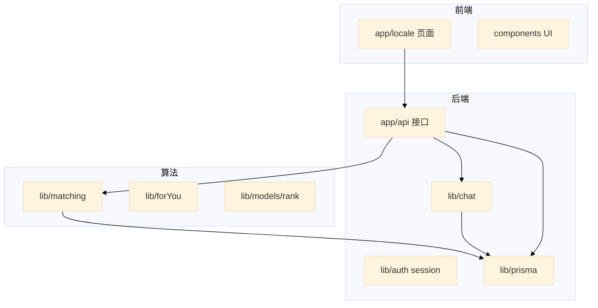
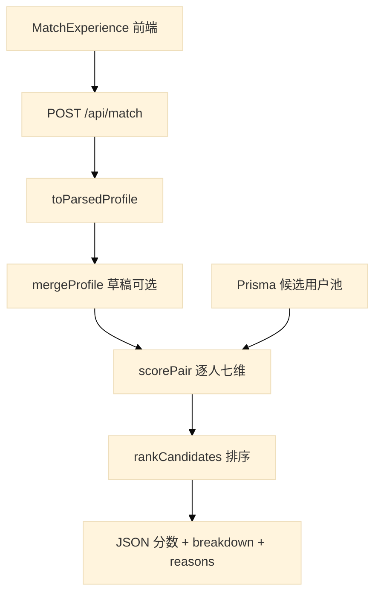
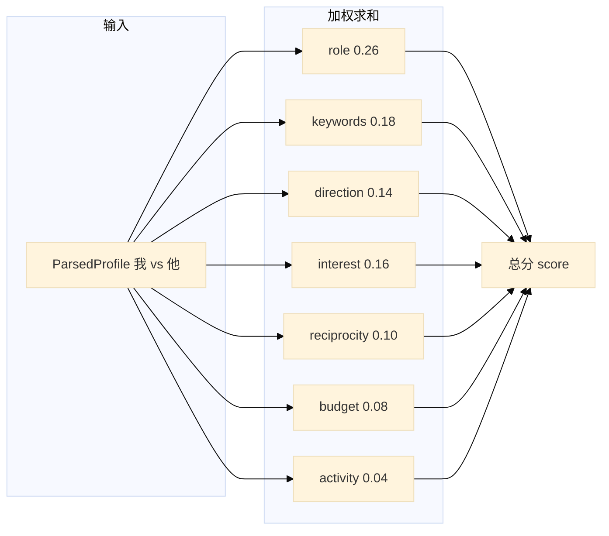
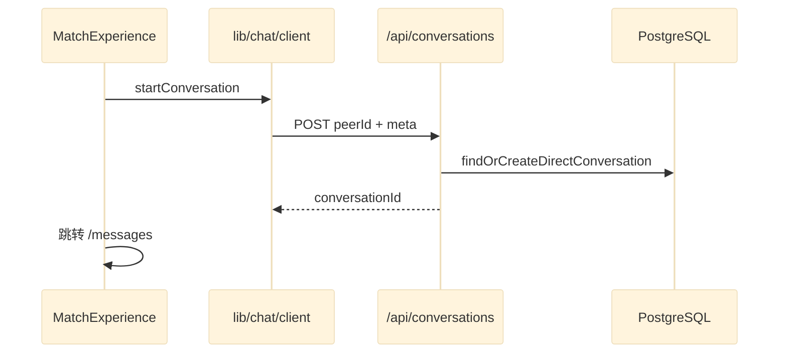
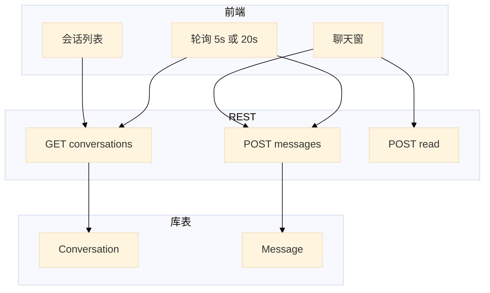

# VibeCoding 技术架构与算法详解

> **程序员看这份**（公式、接口、文件名）。  
> **非技术读者请优先看** [README · 界面与模块详解](../README.md#界面与模块详解) 和 [术语小词典](../README.md#术语小词典看不懂可先看这里)，用大白话讲每个按钮为什么存在。

---

## 阅读须知

1. **「算法 / 前端 / 后端」是分工叫法**，实际仍是 **一个网站程序在跑**（Next.js 单仓），不是三家公司三套系统。
2. **伙伴匹配**：用 7 项资料打分再加权，能产出理由文案；**不用** ChatGPT 式大模型。
3. **私信**：只存消息、算未读、定时刷新；**不算**「谁和你更合拍」。
4. 官网雷达图多为**静态展示**；App 里 `/match` 才是按资料现场算分。
5. 文中「向量」「Jaccard」等是**文本比对算法名**，不是 AI .embedding；不懂可只看百分比权重表。

---

## 目录

- [一、整体架构](#一整体架构)
- [二、算法模块](#二算法模块)
  - [2.1 文件职责](#21-文件职责)
  - [2.2 匹配输入画像](#22-匹配输入画像)
  - [2.3 七维打分公式](#23-七维打分公式)
  - [2.4 文本相似度工具](#24-文本相似度工具)
  - [2.5 匹配 API](#25-匹配-api)
  - [2.6 辅助算法](#26-辅助算法)
- [三、后端模块](#三后端模块)
  - [3.1 逻辑分层](#31-逻辑分层)
  - [3.2 认证与会话](#32-认证与会话)
  - [3.3 聊天模块](#33-聊天模块)
  - [3.4 匹配 → 聊天联动](#34-匹配--聊天联动)
  - [3.5 API 分组速查](#35-api-分组速查)
- [四、前端模块](#四前端模块)
  - [4.1 路由分组](#41-路由分组)
  - [4.2 核心页面与 API 映射](#42-核心页面与-api-映射)
  - [4.3 API 调用模式](#43-api-调用模式)
- [五、数据模型（匹配与聊天相关）](#五数据模型匹配与聊天相关)
- [六、源码索引](#六源码索引)

**结构图速览：** [README · 架构图解](../README.md#架构图解)（产品向总览）· 本文档含匹配/聊天/认证等实现级流程图。

**设计原因（产品向）：** [README · 怎么读](../README.md#目录) · [产品设计哲学](../README.md#产品设计哲学) · [界面与模块详解](../README.md#界面与模块详解)（含 `/match` 每个字段与按钮的设计考量）。

---

## 一、整体架构



| 分层 | 路径 | 职责 |
|------|------|------|
| **前端** | `app/[locale]/`、`components/` | 页面、交互、轮询、雷达可视化 |
| **后端** | `app/api/`、`lib/auth`、`lib/session`、`lib/chat` | HTTP、鉴权、会话、Prisma 读写 |
| **算法** | `lib/matching/`、`lib/forYou.ts`、`lib/models/rank.ts` | 伙伴打分、帖子推荐、模型榜（纯函数，无独立进程） |

**技术栈**：Next.js 14 App Router · React 18 · TypeScript · Tailwind · next-intl · Prisma 5 · PostgreSQL

---

## 二、算法模块

伙伴匹配是**可解释的规则引擎**：角色矩阵 + 经典文本相似度（Jaccard、TF-Cosine、Bigram）+ 双向意向与资金档位。

### 2.1 文件职责

| 文件 | 职责 |
|------|------|
| [`lib/matching/types.ts`](../lib/matching/types.ts) | `ParsedProfile`、`ScoreBreakdown`、`RankedCandidate` 类型定义 |
| [`lib/matching/parseProfile.ts`](../lib/matching/parseProfile.ts) | Prisma `UserProfile` → `ParsedProfile`（解析 JSON 数组字段） |
| [`lib/matching/roleMatrix.ts`](../lib/matching/roleMatrix.ts) | 3×3 角色互补矩阵，归一化到 [0, 1] |
| [`lib/matching/score.ts`](../lib/matching/score.ts) | **七维子分、加权总分、`reasons` 文案生成** |
| [`lib/matching/rank.ts`](../lib/matching/rank.ts) | 候选池全员 `scorePair` → 降序 → `slice(0, limit)` |
| [`app/api/match/route.ts`](../app/api/match/route.ts) | HTTP 入口：`POST` 全量匹配、`GET ?daily=1` 今日一人 |

### 2.2 匹配输入画像

`toParsedProfile(userId, UserProfile)` 产出 `ParsedProfile`：

| 字段 | 来源 | 说明 |
|------|------|------|
| `role` | `UserProfile.role` | `JUNGLE`（增长/BD）· `SUPPORT`（产品/运营）· `ADC`（技术/交付）；非法值兜底 `ADC` |
| `budgetTier` | `UserProfile.budgetTier` | 资金意愿档位 **0–4** |
| `intro` | `UserProfile.intro` | 个人简介 |
| `direction` | `UserProfile.direction` | 创业方向描述 |
| `skillKeywords` | `UserProfile.skillKeywords` | JSON 字符串数组，如 `["Next.js","增长"]` |
| `desiredPartnerRoles` | `UserProfile.desiredPartnerRoles` | JSON 角色数组，期望伙伴类型 |
| `updatedAt` | `UserProfile.updatedAt` | 仅候选人侧用于 `activity` 维度 |

> **`interestTags` 不参与伙伴匹配**，仅用于首页「为你推荐」帖子排序（见 [2.6](#26-辅助算法)）。

### 2.3 七维打分公式

入口函数：`scorePair(me, them)` → `{ score, breakdown, reasons }`

**总分**（权重合计 = 1.0）：

```
score = 0.26×role + 0.18×keywords + 0.14×direction + 0.16×interest
      + 0.10×reciprocity + 0.08×budget + 0.04×activity
```

各子分 ∈ [0, 1]。常量定义见 [`lib/matching/score.ts`](../lib/matching/score.ts) 顶部 `W_*`。

#### 维度 1：role（权重 0.26）

`roleComplementScore(myRole, theirRole)` — 查表后按行归一化：

**原始矩阵 `RAW[my][their]`：**

| my \ their | JUNGLE | SUPPORT | ADC |
|------------|--------|---------|-----|
| JUNGLE | 0.45 | 0.82 | **0.95** |
| SUPPORT | 0.88 | 0.50 | 0.90 |
| ADC | **0.92** | 0.85 | 0.48 |

公式：`RAW[my][their] / max(RAW[my][*])`

设计意图：同角色（对角线偏低分）互补性弱；跨角色组合（如 JUNGLE×ADC）得分更高。

#### 维度 2：keywords（权重 0.18）

```
overlap = 0.5 × Jaccard(skillKeywords) + 0.5 × TF-Cosine(skillKeywords)
desiredRoleBonus = 未填期望 → 0.55；对方 role 在期望列表 → 1；否则 → 0.25
keywordsScore = min(1, 0.6 × overlap + 0.4 × desiredRoleBonus)
```

#### 维度 3：direction（权重 0.14）

对 `direction` 字符串：

| 条件 | 得分 |
|------|------|
| 双方均为空 | 0.55 |
| 仅一方为空 | 0.35 |
| 归一化后完全相等 | 1.0 |
| 一方包含另一方 | 0.88 |
| 其他 | `min(1, 0.5×tokenJaccard + 0.5×bigramOverlap)` |

#### 维度 4：interest（权重 0.16）

词池 = `skillKeywords` + `tokenize(direction)` + `tokenize(intro)`

| 条件 | 得分 |
|------|------|
| 双方词池皆空 | 0.55 |
| 仅一方为空 | 0.35 |
| 其他 | `min(1, 0.6×TF-Cosine + 0.4×Jaccard)` |

#### 维度 5：reciprocity（权重 0.10）— 双向意向

```
theyWantMe = them.desiredPartnerRoles 包含 me.role
iWantThem  = me.desiredPartnerRoles 包含 them.role

双方命中 → 1.0
仅一方命中 → 0.65
都未命中 → max(0.3, roleComplementScore × 0.55)  // 角色互补兜底
```

#### 维度 6：budget（权重 0.08）

`d = |my.budgetTier - their.budgetTier|`

| d | 得分 |
|---|------|
| 0 | 1.00 |
| 1 | 0.82 |
| 2 | 0.58 |
| 3 | 0.35 |
| ≥4 | 0.15 |

#### 维度 7：activity（权重 0.04）

针对**候选人**资料：

```
freshnessScore(updatedAt):
  ≤7 天 → 1.0
  ≤30 天 → 0.85
  ≤90 天 → 0.65
  更久 → 0.45

activity = min(1,
  0.55 × fresh
  + 0.18 × min(1, intro.length/180)
  + 0.12 × (有 direction ? 1 : 0)
  + 0.15 × min(1, skillKeywords.length/6)
)
```

#### reasons 文案

`scorePair` 根据各子分阈值生成最多 **8 条**中文解释（用于 UI 卡片），例如：

- `sRole ≥ 0.9` / `≥ 0.72`：角色互补叙事
- `sRecip ≥ 0.95`：双向意向命中
- `sInt ≥ 0.7` / `≥ 0.45`：兴趣重叠程度
- 共同 `skillKeywords` 会列出具体标签名

#### 排序与 UI 分档

- `rankCandidates(me, pool, limit)`：全员打分 → `score` 降序 → 取 Top-N（默认 10，API 上限 20）
- 前端 [`MatchExperience.tsx`](../components/MatchExperience.tsx)：`percent = round(score × 100)`
  - **≥ 76**：高匹配
  - **≥ 58**：中匹配
  - **< 58**：探索

#### 计算流程图



七维加权汇聚示意：



### 2.4 文本相似度工具

均在 [`lib/matching/score.ts`](../lib/matching/score.ts) 内实现：

| 函数 | 说明 |
|------|------|
| `jaccard(a[], b[])` | 集合交并比；双空 → 0.5；单空 → 0 |
| `tfCosine(a[], b[])` | 词频向量余弦相似度 |
| `bigramOverlap(a, b)` | 字符二元组重叠（方向文本） |
| `tokenize(text)` | 英文按词、中文按**单字**切分；过滤停用词（的、了、the、and…） |

### 2.5 匹配 API

[`app/api/match/route.ts`](../app/api/match/route.ts)

#### `POST /api/match`

**鉴权**：Cookie 会话，未登录 → 401

**请求体**：

```json
{
  "limit": 10,
  "draft": {
    "role": "ADC",
    "budgetTier": 2,
    "intro": "...",
    "direction": "...",
    "skillKeywords": ["Next.js"],
    "desiredPartnerRoles": ["JUNGLE"]
  }
}
```

| 字段 | 说明 |
|------|------|
| `limit` | 1–20，默认 10 |
| `draft` | 可选；与库内画像 `mergeProfile`，用于**未保存画像试算** |

**响应**：`{ me, candidates[] }`，每项含 `userId`、`score`（4 位小数）、`breakdown`、`reasons`、`introPreview`、`direction`

**流程**：读当前用户 Profile → merge draft → 查全库其他用户（有 profile）→ `rankCandidates` → 返回

#### `GET /api/match?daily=1`

**用途**：首页「今日一人」

**流程**：

1. 全池 `rankCandidates(me, pool, pool.length)`（按总分排序）
2. `seed = userId + ":" + YYYY-MM-DD`
3. 字符串 hash：`hash = (hash * 31 + charCode) >>> 0`
4. `pick = ranked[hash % ranked.length]`

同一天、同一用户结果**确定性稳定**；跨日变化。

### 2.6 辅助算法

与伙伴匹配**相互独立**，勿混淆：

#### 首页 For You（帖子推荐）

文件：[`lib/forYou.ts`](../lib/forYou.ts) · 用于 [`home/page.tsx`](../app/[locale]/(shell)/(tabs)/home/page.tsx) for-you 视图

```
scorePostForProfile(post, profile):
  无画像 → (timeDecay + popularityBoost) × 2   // 冷启动

  relevance = Σ 兴趣标签命中 post.tags +3、正文 +2
            + Σ 技能词命中正文 +2

  return relevance × timeDecay + popularityBoost

timeDecay: 半衰期约 168 小时（7 天），1 / (1 + ageHours/168)
popularityBoost: log1p(likes + saves×2) / 10
```

#### 大模型排行榜

文件：[`lib/models/rank.ts`](../lib/models/rank.ts)

```
computeRankScore(avgRating, reviewCount)
  = round((avgRating × 0.7 + log10(reviewCount + 1) × 0.8) × 100) / 100
```

#### 资料完善度（留存引导）

文件：[`lib/retention.ts`](../lib/retention.ts) · `profileCompletenessScore`

- role 20 + direction≥4 字 25 + intro≥20 字 25 + ≥2 关键词 30 → 最高 100
- **不参与** `scorePair`

---

## 三、后端模块

### 3.1 逻辑分层

| 层 | 路径 | 说明 |
|----|------|------|
| 路由层 | `app/api/**/route.ts` | HTTP 入口、JSON、状态码 |
| 领域层 | `lib/matching`、`lib/chat`、`lib/auth` | 可复用业务逻辑 |
| 数据层 | `lib/prisma.ts` + `prisma/schema.prisma` | PostgreSQL ORM |

共 **31** 个 API Route Handler；无独立 Express/FastAPI 服务。`main.py` 仅为本地启动 Next 开发服务器的辅助脚本。

### 3.2 认证与会话

```
浏览器 Cookie: vbc_session
  → lib/session.ts: getUserIdFromCookies()
  → lib/auth/sessionStore.ts + Prisma Session 表
```

- 密码：`lib/auth/password.ts`（bcrypt）
- 页面保护：`middleware.ts`（i18n + 受保护路由重定向）
- **API 路径**在 middleware 中视为 public，各 route 自行返回 401

### 3.3 聊天模块

> **聊天不做匹配打分**。仅为 1:1 私信 CRUD、未读计数、REST 轮询。

#### 相关文件

| 类型 | 路径 |
|------|------|
| API | `app/api/conversations/route.ts` |
| API | `app/api/conversations/[id]/messages/route.ts` |
| API | `app/api/conversations/[id]/read/route.ts` |
| 领域 | `lib/chat/conversations.ts`、`lib/chat/parseMeta.ts` |
| 客户端 | `lib/chat/client.ts` |

#### 数据模型

- `Conversation`：会话容器，`updatedAt` 在发消息时刷新（列表排序）
- `ConversationParticipant`：每用户一条，`lastReadAt` 用于未读
- `Message`：`body` + `meta`（JSON 字符串，默认 `"{}"`）

#### 核心逻辑

**1. 建会话** — `findOrCreateDirectConversation(userA, userB)`

- 查找同时包含 A、B 且 `participants.length === 2` 的会话
- 不存在则 `create` 两名参与者
- 不能与自己聊天

**2. 发消息** — `POST .../messages`

- `message.create` + `conversation.update({ updatedAt })`
- `body` 必填；`meta` 可选 JSON

**3. 未读判断** — `GET /api/conversations`

```text
unread = 存在最后一条消息
     AND 最后一条 senderId ≠ 当前用户
     AND (lastReadAt 为空 OR lastReadAt < 最后消息.createdAt)
```

**4. 已读** — `POST .../read`

- 更新当前用户 `ConversationParticipant.lastReadAt = now()`

**5. 传输方式**

- **REST only**，无 WebSocket / SSE
- [`MessagesClient.tsx`](../app/[locale]/(shell)/(tabs)/messages/MessagesClient.tsx)：当前会话消息轮询 **5s**（前台）/ **20s**（后台）
- [`useConversationStats.ts`](../lib/hooks/useConversationStats.ts)：会话列表轮询 **8s** / **30s**

#### 聊天 API 明细

| 方法 | 路径 | Body / Query | 说明 |
|------|------|--------------|------|
| GET | `/api/conversations` | — | 会话列表 + 最后消息 + unread + match 来源 |
| POST | `/api/conversations` | `{ peerId, meta? }` | 建/取 1:1 会话；空会话可写首条带 meta 的消息 |
| GET | `/api/conversations/[id]/messages` | `cursor?` | 每页 50 条，时间升序返回 |
| POST | `/api/conversations/[id]/messages` | `{ body, meta? }` | 发送消息 |
| POST | `/api/conversations/[id]/read` | — | 标记已读 |

**POST /api/conversations 首条消息逻辑**：若 `meta` 非空且会话尚无消息，可写入首条：

- `meta.draftMessage` 优先
- 否则 `meta.source === "match"` 时用默认文案：「你好，通过匹配想聊聊合作。」

### 3.4 匹配 → 聊天联动



#### 聊天数据流总览



| 步骤 | 说明 |
|------|------|
| 1 | 用户在匹配结果点击「联系」 |
| 2 | `startConversation(peerId, { source: "match", contextTitle })` |
| 3 | 跳转 `/messages?peer={id}&intent=match` |
| 4 | `MessagesClient` 根据 `intent=match` 可预填破冰模板（[`MESSAGE_INTENT_TEMPLATES.match`](../lib/retention.ts)） |

会话列表通过 `metaFromMessages` 解析历史消息 `meta`，展示 `source: "match"` 标签。

### 3.5 API 分组速查

| 分组 | 端点 | 说明 |
|------|------|------|
| **健康** | `GET /api/health` | 部署探活 |
| **认证** | `POST /api/auth/login` `register` `logout` `guest` | 会话 Cookie |
| | `POST .../forgot-password` `reset-password` `verify-email` | 邮箱流程（可选 Resend） |
| **用户** | `GET/PATCH /api/me` | 当前用户 |
| | `GET /api/users/[id]` · `GET/PATCH /api/profile` | 他人信息 / 创业画像 |
| **内容** | `GET/POST /api/posts` · `GET/PATCH/DELETE .../[id]` | 帖子 CRUD |
| | `POST .../react` · `GET/POST .../comments` | 互动 |
| **社交** | `POST /api/follow` · `GET /api/feed/following` | 关注流 |
| **匹配** | `GET /api/match?daily=1` · `POST /api/match` | 见 [2.5](#25-匹配-api) |
| **消息** | `GET/POST /api/conversations` · `.../messages` · `.../read` | 见 [3.3](#33-聊天模块) |
| **工具/模型** | `GET /api/models` · `POST .../reviews` · `tools/[id]/reviews` | 目录与评价 |
| **其他** | `GET /api/home/rail` · `learn/progress` · `wishlist` · `orders` · `templates` | 首页侧栏 / 学习 / 电商演示 |
| **运维** | `POST /api/seed` | 需 `DEMO_SEED_SECRET` |

---

## 四、前端模块

### 4.1 路由分组

| 分组 | 路径示例 | 用途 |
|------|----------|------|
| `(marketing)` | `/`、`/login` | 品牌落地页 |
| `(shell)/welcome` | `/welcome/login`、`/register`、`/guest` | Onboarding |
| `(shell)/(tabs)` | `/home`、`/match`、`/messages`、`/me` | 主应用（底 Tab / Web 侧栏） |
| `app/api` | `/api/match` | 与页面同进程 BFF |

**国际化**：中文 `/match` · 英文 `/en/match`（[`messages/zh.json`](../messages/zh.json)、[`en.json`](../messages/en.json)）

**视图模式**：`ViewModeProvider` — App 手机壳 + 底 Tab vs Web 三栏桌面（`sessionStorage: vbc_view_mode`）

### 4.2 核心页面与 API 映射

| 功能 | 路由 | 关键组件 | API / 数据 |
|------|------|----------|------------|
| 伙伴匹配 | `/match` | `MatchExperience.tsx` | `GET/PUT /api/profile`、`POST /api/match` |
| 今日一人 | `/home` | `DailyMatchCard.tsx` | `GET /api/match?daily=1` |
| 私信 | `/messages` | `MessagesClient.tsx` | `lib/chat/client.ts` → conversations API |
| 编辑画像 | `/settings/profile` | `ProfileEditor.tsx` | `/api/profile` |
| 他人主页 | `/user/[id]` | `UserPageTabs` 等 | 部分 **RSC 直查 Prisma**，不经 REST |
| 营销雷达 | `/`（品牌站） | `WebMatchPreview.tsx` | **静态演示**，不调 `/api/match` |

**主导航 Tab**（[`lib/navConfig.ts`](../lib/navConfig.ts)）：`/home` · `/match` · `/messages` · `/me`

### 4.3 API 调用模式

| 模式 | 示例 | 适用场景 |
|------|------|----------|
| **集中封装** | `lib/chat/client.ts` | 聊天全流程 |
| **组件内 fetch** | `MatchExperience`、`ProfileEditor` | 匹配、画像 |
| **全局 Hook** | `useClientUserId` → `GET /api/me` | 登录态缓存 |
| **RSC 直查 DB** | `user/[id]/page.tsx` | 公开主页 SSR |

统一约定：`credentials: "include"` 携带会话 Cookie；无 axios。

---

## 五、数据模型（匹配与聊天相关）

摘自 [`prisma/schema.prisma`](../prisma/schema.prisma)：

**UserProfile**（匹配输入）

| 字段 | 类型 | 匹配用途 |
|------|------|----------|
| `role` | String | role 维度 |
| `budgetTier` | Int | budget 维度 |
| `intro` | String | interest、activity |
| `direction` | String | direction、interest |
| `skillKeywords` | String (JSON) | keywords、interest |
| `desiredPartnerRoles` | String (JSON) | keywords 加成、reciprocity |
| `interestTags` | String (JSON) | **仅 forYou**，不匹配 |
| `updatedAt` | DateTime | activity |

**Conversation / Message**（聊天）

见 [3.3](#33-聊天模块)。`Message.meta` 示例：

```json
{ "source": "match", "contextTitle": "技能互补推荐" }
```

---

## 六、源码索引

### 算法

```
lib/matching/
├── types.ts
├── parseProfile.ts
├── roleMatrix.ts
├── score.ts      ← 七维公式核心
└── rank.ts
lib/forYou.ts
lib/models/rank.ts
app/api/match/route.ts
```

### 聊天

```
lib/chat/
├── conversations.ts
├── parseMeta.ts
└── client.ts
app/api/conversations/
├── route.ts
└── [id]/
    ├── messages/route.ts
    └── read/route.ts
```

### 前端（匹配 / 聊天）

```
components/MatchExperience.tsx
components/home/DailyMatchCard.tsx
app/[locale]/(shell)/(tabs)/match/page.tsx
app/[locale]/(shell)/(tabs)/messages/MessagesClient.tsx
components/settings/ProfileEditor.tsx
```

---

## 延伸阅读

- [README.md](../README.md) — 快速开始、部署、种子账号、完整路由表
- [MODELS_DEMO.md](../MODELS_DEMO.md) — 大模型排行演示说明
- [`.env.example`](../.env.example) — 环境变量
